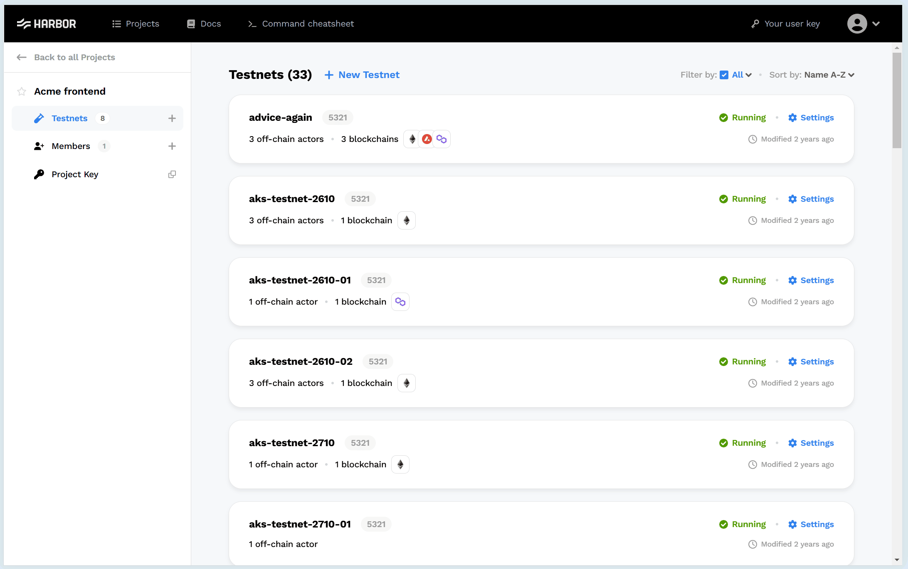
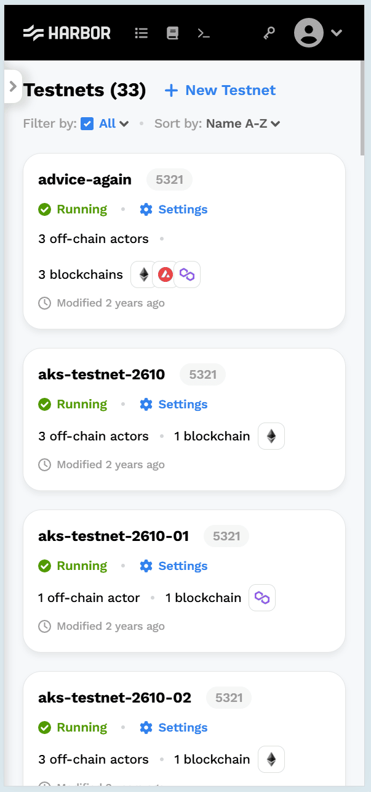
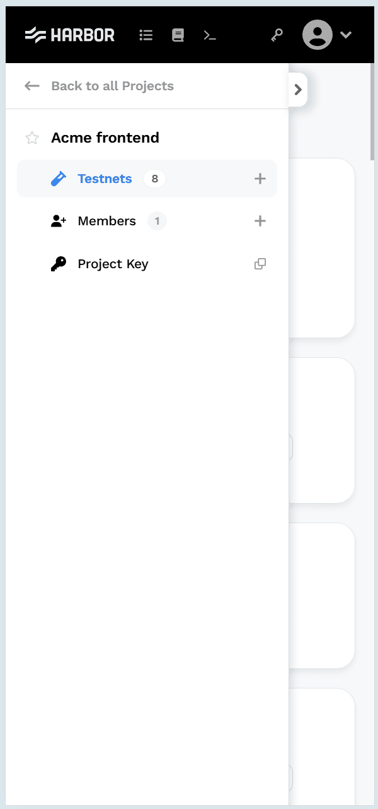
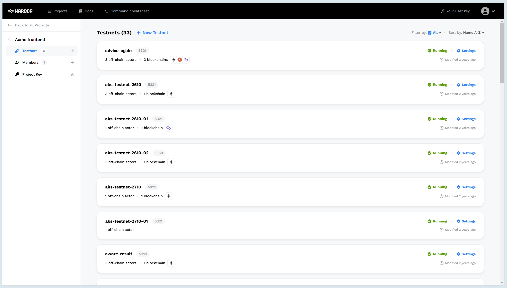
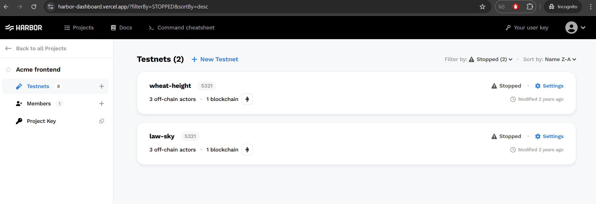
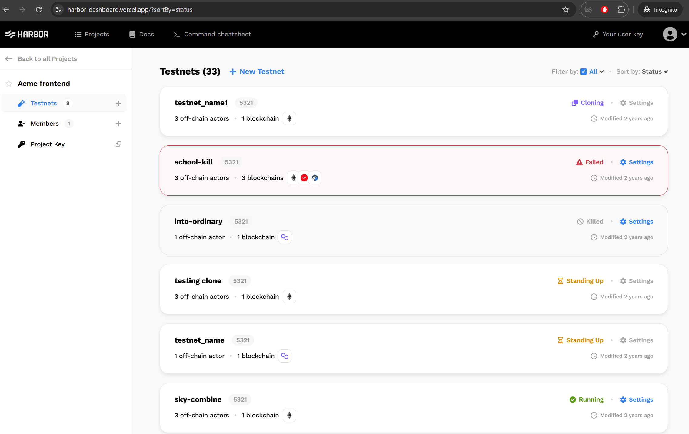
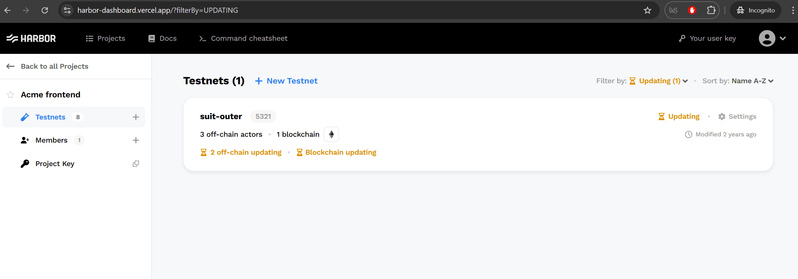
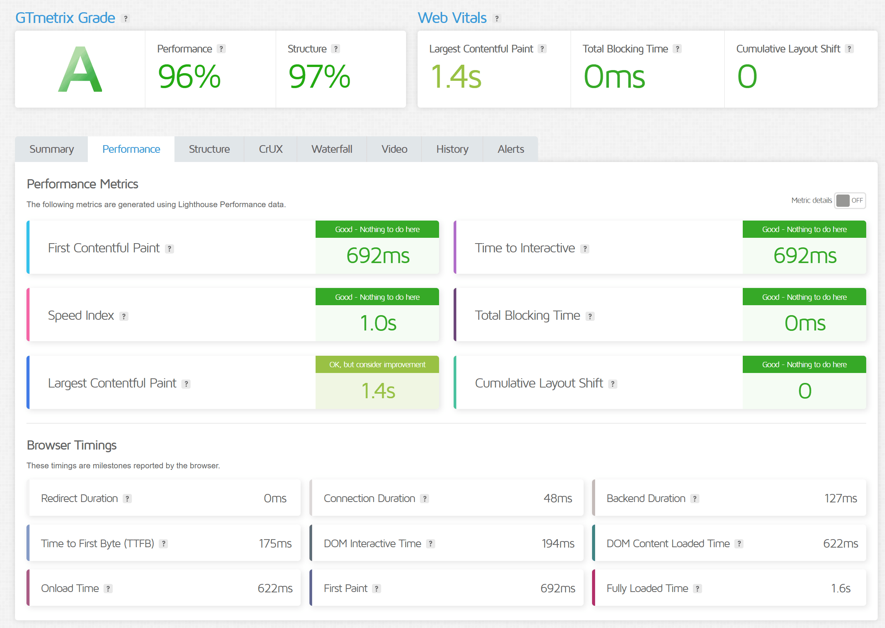
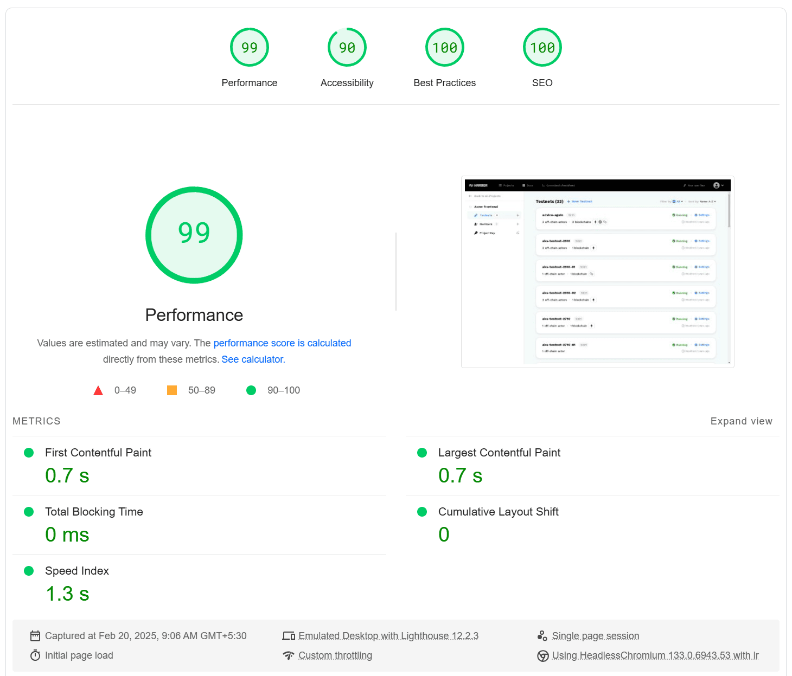

# Harbor Client Frontend Application

App Demo: [Harbor Dashboard](https://harbor-dashboard.vercel.app/)

## Overview

This pull request delivers the frontend design as specified in the [take-home assignment](https://github.com/harbor-xyz/frontend-take-home).

## Development Approach

The application is crafted using React to build scalable and reusable components. The following techniques adhere to best practices and enhance performance and maintainability:

- **Atomic Design Principles**: Components are categorized for reusability and scalability:
  - **Atoms**: Fundamental building blocks like `Button`, `Text`, and `Flexbox`.
  - **Molecules**: Combinations of atoms forming more complex components like `Dropdown` and `BadgeList`.
  - **Organisms**: Assemblies of molecules and atoms forming distinct UI sections like `Headers` and `Sidebar`.
  - **Templates**: Page-level layout components defining the structure of a page.
  - **Pages**: Complete pages using a combination of all components to form the final UI, managing `states` and passing them down as `props` through the component hierarchy.
- **BEM Methodology**: Modular and maintainable namespaced CSS classes, providing less specificity on an element.
- **Media Queries**: Ensures responsive design.
- **Optimised Performance**: To minimize redundant re-renders and computations using `useMemo` and `useCallback` hooks.
- **Routing**: To facilitate navigation and future scalability.
- **Semantic HTML**: Promotes SEO and accessibility.
- **Testing**: Integrated unit testing with `Jest` and `React Testing Library` covering all developed components.

### Considerations

- **Next.js**: Both `client` and `server` applications are managed (and even deployed) separately.
- **Redux**: Omitted to maintain simplicity, as managing props and state are sufficient for this project.
- **Context API**: Not utilized to prevent frequent re-renders and maintain component reusability.
- **Tailwind CSS**: BEM methodology was preferred over a utility-first approach that might not align with the existing styling strategy.
- **TypeScript**: Deprioritized due to limited scope and time constraints, using React-based `prop-types` instead.
- **Alternative Architectures**: PWA and Micro Frontends are not implemented as they are deemed unnecessary for this project.

Any combinations of the above-mentioned techniques can be explored once we scale our application with more pages and features.

## Features Implemented

As per the given requirements:
- Responsive dashboard showcasing testnets with their respective statuses and details.
- Testnet results are sortable (based on name, status, creation date, and modified date) and filterable (based on status).
- URL parameters are updated during sort and filter changes, ensuring sorted and filtered results upon refreshing the browser.
- The application gracefully handles loading, error, and zero state use cases.

### Screenshots

#### Default View

#### Mobile View

#### Monitor View

#### Testnet with Filtering

#### Testnet with Sorting

#### Testnet with Both Filtering and Sorting

## Performance Audit

The application was tested using the following tools:

### GTmetrix
[Report Link](https://gtmetrix.com/reports/harbor-dashboard.vercel.app/0Nt7k0So/)

### PageSpeed Insights
[Report Link](https://pagespeed.web.dev/analysis/https-harbor-dashboard-vercel-app/37t3s8t08w?form_factor=desktop)

## Installation and Code Execution

To start the backend API server (in a separate terminal):

1. Navigate to the `server` directory.
2. Install dependencies with `npm install`.
3. Execute `npm run dev` to run the server at `http://localhost:3000/`. 
4. Verify on the web browser at `http://localhost:3000/api/testnets` which will return mock testnets data.

To launch the frontend React client application (in a separate terminal):

1. Navigate to the `client` directory.
2. Install dependencies with `npm install`.
3. Create a new `.env` file and add `REACT_APP_API_URL=http://localhost:3000/api` as an environment varaible.
3. Execute `npm run start` to run the applation at `http://localhost:3001/` automaitcaly opening the browser.
4. Verify on the web browser to see the dashboard rendering the testnets as per given design.

## Additional Notes
- Enabled `CORS` on the `server` API endpoints for `client` application requests.
- Altered the testnets JSON data to showcase the final result with various statuses and their specific conditions.

## Client Testing
Run `npm run test -- --coverage --watchAll` at `client` directory to generate code coverage report.

## Future Enhancements
Apart from alternative architectures mentioned earlier, there are some potential improvements that can be considered for further development:
- Implement filter by `search` input.
- Implement `pagination` and `infinite scrolling` for handling large datasets.
- Integrate `Storybook` for component documentation.
- Add E2E tests using `Cypress` or `Playwright` for improved test coverage.
- Ensure full compliance with accessibility standards.
- Support CSS theming for both light and dark modes.
- Optimize images and other assets for better performance.
- Integrate `ESLint` and `Prettier` for ensuring consistent coding style across the team.
- Intergrate `GitHub Actions` for seamless CI/CD pipeline.
- Explore `GraphQL` for efficient data fetching when scaling up.

Any further feedback is highly appreciated.